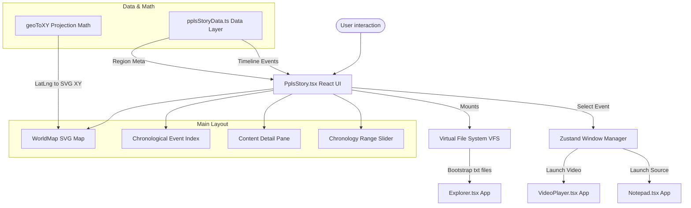

# The Ppls Story — Application Architecture & Operation Guide

The Ppls Story is an interactive multimedia CD-ROM encyclopedia (styled after 1990s titles like *Microsoft Encarta*) integrated as a first-class application within the HQ OS Windows 98 desktop environment. It serves as a liberation history reference tool.

---

## 1. High-Level Architecture

The application is structured into a clean **model-view-controller** paradigm separating state management, geographic calculation, file-system interaction, and display logic:



---

## 2. Data Layer (`pplsStoryData.ts`)

The data layer is isolated from the React rendering loop to guarantee clean data retrieval and type safety.

### Interfaces
- **`TimelineEvent`**: Represents a historical milestone.
  ```typescript
  export interface TimelineEvent {
    id: string;
    year: number;
    region: Region; // 'Africa' | 'Americas' | 'Global'
    title: string;
    summary: string;
    mediaType: MediaType; // 'text' | 'video' | 'audio' | 'image'
    mediaPayload: string; // VFS path, video URL, etc.
    primarySourceText?: string; // Launchable notepad document
    tags?: string[];
    artist?: string; // Speaker or creator
    location: { lat: number; lng: number; name: string };
  }
  ```
- **`RegionMeta`**: Stores visualization styles (colors, display names) for the map and badges.

### Query Helpers
- `getFilteredEvents(region, startYear, endYear)`: Filters events according to active sidebar selections and chronology slider values.
- `getYearRange()`: Resolves the minimum and maximum years in the dataset (currently `1312` to `1990`) to scale UI sliders.

---

## 3. VFS Bootstrapping

When the app mounts, it interacts with the virtual file system (`vfs`) to export the encyclopedia's database into the user's OS workspace.

```typescript
function bootstrapVFS() {
  if (vfsBootstrapped) return;
  vfsBootstrapped = true;
  try {
    vfs.mkdir('C:/Ppls_Story');
    TIMELINE_EVENTS.forEach((evt) => {
      if (evt.primarySourceText) {
        const filename = evt.id.replace(/[^a-zA-Z0-9_-]/g, '_') + '.txt';
        vfs.writeFile(`C:/Ppls_Story/${filename}`, evt.primarySourceText);
      }
    });
  } catch (e) {
    console.error('Failed to bootstrap Ppls_Story VFS:', e);
  }
}
```
* **Effect**: Creates a physical-feeling folder structure `C:\Ppls_Story\` inside the VFS containing text files of speeches and documents. The user can browse, open, and edit these files directly using the system **Explorer** or **Notepad** application.

---

## 4. Interactive SVG Map (`WorldMap`)

The map component uses custom geographic vector paths projected onto a $1000 \times 500$ viewport.

### Coordinates Projection
We map spherical coordinates (latitude and longitude) onto flat Cartesian space using an **Equirectangular Projection**:
* **Longitude to X**: $x = (\text{lng} + 180) \times \frac{1000}{360}$
* **Latitude to Y**: $y = (90 - \text{lat}) \times \frac{500}{180}$

```typescript
const geoToXY = (lat: number, lng: number) => {
  const x = (lng + 180) * (1000 / 360);
  const y = (90 - lat) * (500 / 180);
  return { x, y };
};
```

### Map States
The map tracks translation offsets and scale multiplier in its state:
* `zoom`: Current scale factor (ranging from $1.0\times$ to $8.0\times$).
* `translateX`, `translateY`: Translation offsets in SVG user coordinates.
* `isDragging`: Tracks whether the user is currently panning the map.

### Vector Pan and Zoom Mathematics
1. **Interactive Panning**: Delivers standard click-and-drag mechanics. Delta screen pixel offsets are scaled to SVG user space using display box dimensions:
   $$\text{dx}_{\text{svg}} = \text{dx}_{\text{screen}} \times \frac{1000}{\text{width}_{\text{client}}}$$
   $$\text{dy}_{\text{svg}} = \text{dy}_{\text{screen}} \times \frac{500}{\text{height}_{\text{client}}}$$
2. **Cursor-Centered Zoom**: Ensures zooming with the scroll wheel centers on the mouse cursor rather than the top-left corner:
   $$\text{mapX} = \frac{\text{cursorX}_{\text{svg}} - \text{translateX}}{\text{zoom}}$$
   $$\text{newTranslateX} = \text{cursorX}_{\text{svg}} - \text{mapX} \times \text{nextZoom}$$
3. **Bounding Box Clamping**: Translates are bounded to prevent panning the map outside visible limits:
   $$\text{translateX}_{\text{min}} = 1000 \times (1 - \text{zoom})$$
   $$\text{translateX}_{\text{max}} = 0$$

### Smart Indicators & Compensated Scale
- **Adaptive Pin Scaling**: To prevent pins from becoming enormous and blurry when zooming in, the pin groups scale inversely relative to the map's zoom level:
  `transform="translate(x, y) scale(1 / zoom)"`
- **Chronology Awareness**: Pins are divided into active (colored red/yellow based on slider range) and inactive (rendered in muted gray).
- **Auto-Focusing (Fly-To)**: Selecting a timeline event triggers a React effect that computes centering coordinates and smoothly interpolates translation and zoom to $3.5\times$, centering the event in the viewport.

---

## 5. UI Layout & Controls

The visual container is built using a classic 16-color Windows 98 aesthetic:
- **Menu Bar**: Classic Win98 menu layout with a shortcut button to open the virtual directory in Explorer.
- **Tabs**: Large region buttons styled with outset borders. Selecting a region limits both the list and the map's active pins.
- **Chronology Slider**: A Win98 trackbar input. It filters the event index, showing only milestones that have occurred *up to* the selected year.
- **Bottom Panes**:
  - **Index (Left)**: Scrollable list of filtered events showing their years, titles, and region abbreviations. Selecting an item highlights it in deep navy blue (`#000080`).
  - **Content Viewer (Right)**: Detailed overview displaying event synopsis, tags, and a primary source excerpt.

---

## 6. OS Integration & Cross-Routing

The Ppls Story leverages the system-wide Zustand Window Manager to spin up and direct other applications:

1. **Watch Video** (Available for video media types):
   Spawns the `video-player` app, loading the corresponding YouTube video ID (e.g. Malcolm X's speech) directly into a vintage wrapper window:
   ```typescript
   openWindow({
     id: `ppls-video-${evt.id}`,
     title: `${evt.title} — Media Player`,
     appType: 'video-player',
     appProps: { videoSrc: evt.mediaPayload, videoTitle: evt.title }
   });
   ```
2. **Read Full Source** (Available for text media types):
   Launches the `notepad` app, pointing it directly at the boot-generated `.txt` file in the VFS workspace:
   ```typescript
   openWindow({
     id: `ppls-doc-${evt.id}`,
     title: `${evt.title} - Notepad`,
     appType: 'notepad',
     appProps: { filePath: `C:/Ppls_Story/${filename}` }
   });
   ```
3. **Browse Files**:
   Launches the native `explorer` app focused on `C:/Ppls_Story` to let the user manipulate, print, or drag files in the VFS.
