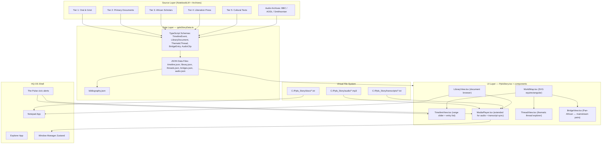
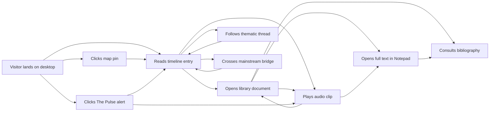

# Restructuring Historical Epistemology: A Pan-African Digital Architecture

This document provides a comprehensive overview of **The Ppls Story** project, a simulated retro-styled digital library designed to reconstruct historical narratives from an endogenous, non-Western perspective. It details the decolonial pedagogical framework, epistemological pillars, content matrices across eight historical eras, map mathematics, technical architecture, and a step-by-step 6-month execution plan.

---

## 1. Decolonial Pedagogical Framework

The reconstruction of historical narratives from an endogenous, non-Western perspective represents a critical intervention in both digital humanities and global historical pedagogy. For generations, dominant historiographical models deployed in public education systems have structurally marginalized the contributions, philosophies, and continuous political evolutions of the African continent and its global diaspora. 

In response to this epistemological imbalance, **The Ppls Story** serves as a restorative educational environment. This platform operates not merely as a chronological sequence of isolated historical events, but as a living map of resistance, brilliance, and cultural continuity stretching across five millennia.

### Target Audience & Aesthetic Style
To engage the target demographic of **16- to 28-year-olds**—who exhibit curiosity, political engagement, and a healthy skepticism toward conventional, school-taught histories—the project deploys a visually stimulating educational interface designed with a retro **Windows 98, CD-ROM, and Encarta-style desktop shell**. This aesthetic choice provides a familiar, nostalgic, yet highly structured digital container that makes the deep exploration of complex ideological movements approachable and engaging.

### The Dual-Pronged Approach
1. **Primary Source Immersion**: The platform plunges the user directly into the primary sources generated by African and diasporic actors. It insists that users read the actual words of historical figures rather than relying on secondary summaries. The project has established a metric demanding that at least **70 percent of testers** confirm they have read historical figures' own words.
2. **Mainstream Bridge Threads**: It strategically utilizes "bridge threads" that connect these endogenous developments to mainstream global events typically taught in Western curricula. This bridging mechanism ensures that users transitioning from standard US public-school backgrounds maintain a foothold in familiar chronological markers while discovering how African and diasporic events bi-directionally influenced, and often entirely shaped, global history.

### The North Star
The ultimate goal of the project is to create a digital space where a 19-year-old can spend **20 minutes** and leave with a profound understanding that Pan-Africanism is a 5,000-year continuity of continental and diasporic struggle.

---

## 2. Epistemological Pillars and Source Stratification

### The Five Core Editorial Pillars
The structural integrity of this digital repository is maintained through strict adherence to five core editorial pillars:

1. **Continuous Pan-African Narrative**: Explicitly traces the ideological and political linkages across thousands of years. It shows how the socio-political organizing principles of ancient Kemet evolved and echoed through the Manden Charter, the Haitian Revolution, the Universal Negro Improvement Association, and contemporary continental free trade agreements.
2. **Non-Western Source Priority**: Western historiography is relegated to a secondary reference layer, utilized exclusively for corrective notes or mainstream bridges. Disagreements between African and Western records are explicitly surfaced and analyzed rather than hidden, teaching users the mechanics of historiographical bias.
3. **Youth-Friendly Scholar Voice**: Calibrated to function like a *"brilliant older cousin at the cookout."* The tone remains mathematically rigorous and heavily sourced, yet direct, warm, and entirely free of alienating academic jargon.
4. **Bi-Directional Causation Bridges**: Dedicated bridge threads demonstrate how events inside the African diaspora directly influenced global histories—for instance, how Ghana's 1957 independence accelerated the US Civil Rights Movement.
5. **The Historical Document as Protagonist**: Entries lead with actual source excerpts. For speeches, oral recitations, or songs, the audio archive is treated as the primary historical form, with textual transcripts acting only as the shadow, honoring the primacy of the oral tradition in African epistemology.

### Source Tier Stratification
To enforce the non-Western source priority, research materials are categorized into a rigorous hierarchical tier system:

| Source Tier | Category | Description and Prioritized Content |
| :--- | :--- | :--- |
| **Tier 1** | Oral & Griot Traditions | Pre-colonial political philosophy, cosmology, and social charters. This tier explicitly rejects the Western convention of labeling oral transmission as "myth." It prioritizes the *Ifa corpus*, the *Sundiata epic*, and the *Mwindo* and *Ozidi* traditions. |
| **Tier 2** | Primary Documents | Constitutional and declarative moments, treaties, and organizational platforms. Essential texts include the *Manden Charter*, the *ANC Freedom Charter*, *Ma'at* texts, and Nkrumah's speeches. |
| **Tier 3** | African Scholars | Analytical framing, historiographic correction, and movement theories authored by foundational scholars such as Cheikh Anta Diop, Walter Rodney, Achille Mbembe, and Ngũgĩ wa Thiong'o. |
| **Tier 4** | Liberation Press | Movement-internal debates, contemporary analysis, and archival journalism from platforms like CODESRIA, Pambazuka, the Black Agenda Report, and CASAS. |
| **Tier 5** | Cultural Texts | Aesthetic, sonic, and literary expressions that capture the zeitgeist of resistance, including works by Frantz Fanon, Mariama Bâ, Léopold Senghor, and the lyric sheets of Fela Kuti. |

### Schema Verification
The underlying database schema `TimelineEvent` requires specific fields for every entry, including `id`, `year`, `era`, `region`, `mediaType`, `primarySourceText`, and `primarySourceCitation`. Every claim, date, and quote must carry an inline citation to an uploaded source, and any claim relying on a mainstream Western source must be explicitly marked as a bridge use, structurally immunizing the platform against colonial assumptions.

---

## 3. The Eight Eras of Pan-African Liberation History

### Era 1: The Ancestral Dawn and Classical Antiquity (c. 3000 BCE to 500 CE)
Rather than initiating the narrative of human civilization with Greece or Rome, the timeline firmly establishes the African origins of science, philosophy, architecture, and complex governance, rooted in the historiographical thesis of Cheikh Anta Diop. Kemet (Ancient Egypt) is reframed as a foundational Black African civilization alongside the Kingdom of Kush (Nubia) and the Aksumite Empire.

*   **Anchor Document**: The **Victory Stela of Piye** (c. 747–716 BCE). 
*   **Context**: King Piye, a Kushite ruler of the Napatan period, launched a military campaign to conquer fragmented Egyptian territories and establish the Twenty-fifth Dynasty. Discovered at Jebel Barkal in 1862 and carved into granite, the stela details Piye's victory over Prince Tefnakht of Sais, the Chief of the West. Piye did not frame himself as a foreign conqueror, but as the legitimate, indigenous inheritor of sacred Egyptian traditions, declaring his divine right to rule as the son of Ra and the beloved of Amun. The stela highlights Piye's profound compassion and reverence for life, notably his love and protection of horses, which were buried alongside him at El-Kurru.
*   **Excerpt**: 
    > "O mighty ruler, O mighty ruler! Piye, O mighty ruler! You return having conquered Lower Egypt; making bulls into women! Happy is the heart of the mother who bore you... You are eternal, your victory enduring."
*   **Pedagogical Goal**: Proves that complex geopolitical maneuvering, diplomatic restraint, structural statecraft, and profound literary rhetoric were deeply embedded in African antiquity long before European contact.

### Era 2: Medieval and Islamic Systems (500 to 1500)
Explores the consolidation of vast, complex empires in West Africa and the sophisticated social contracts that governed them.

*   **Anchor Document**: The **Manden Charter of Kurukan Fuga** (1236 CE).
*   **Context**: Following the Battle of Kirina, the founder of the Mali Empire, Sundiata Keita, assembled his wise men to draft one of the oldest constitutions in the world. Reconstructed by Guinean historian Djibril Tamsir Niane, the 44 articles represent an advanced declaration of human rights, personal responsibilities, and ecological management.
*   **Excerpts & Specific Articles**:
    *   *Article 37*: Nominates Fakombè as the chief of hunters.
    *   *Article 38 (Ecology)*: "Before setting fire to the bush, don't look down at the ground, raise your head in the direction of the top of the trees to see whether they bear fruits or flowers."
    *   *Article 39*: Addresses civic organization, stating that domestic animals should be tied during cultivation and freed after harvest, except "the dog, the cat, the duck and the poultry are not bound by the measure."
    *   *Article 40*: Mandates that citizens respect kinship, marriage, and the neighborhood.
    *   *Article 41 (Warfare)*: "You can kill the enemy, but not humiliate him."
*   **Pedagogical Goal**: Directly challenges the colonial narrative that Africa existed in a state of pre-colonial lawlessness by presenting a 13th-century constitution that protects women, regulates the environment, and prevents the abuse of prisoners of war.

### Era 3: Encounter and Enslavement (1500 to 1800)
This era fundamentally alters the narrative of the transatlantic slave trade by centering African resistance, syncretic cultural survival, ontological warfare, and armed revolution.

*   **Anchor Document**: **Boukman’s Prayer at the Bois Caïman Ceremony** (August 14, 1791).
*   **Context**: Catalyzed by a secret congress in the woods of Saint-Domingue near Le Cap, the ceremony was presided over by Dutty Boukman, an Houngan (Vodou priest), and Cécile Fatiman, a Mambo. Over 116,000 African captives from Kongo/Angola and 55,000 from Lower Guinea (Ewe-Fon) were united under the homogeneous cultural and spiritual framework of Vodou.
*   **Excerpt**:
    > "Our God who has ears to hear. You who are hidden in the clouds; who watch us from where you are. You see all that the white has made us suffer. The white man's god asks him to commit crimes. But the god within us wants to do good... We all should throw away the image of the white men's god who is so pitiless. Listen to the voice for liberty that speaks in all our hearts."
*   **Mainstream Bridge**: Connects the Haitian Revolution to the Louisiana Purchase. Napoleon Bonaparte's forces were financially and physically exhausted by the Haitian revolutionaries, directly forcing the sale of the Louisiana Territory to the United States and altering the geopolitical map of North America.

### Era 4: Colonial Conquest and Resistance (1800 to 1900)
Highlights early demands for civic sovereignty, the struggle against corporate colonialism, and the matriarchal defense of indigenous political structures.

*   **Diasporic Legal Resistance (The Freetown Petitions)**: 
    *   *Context*: Freetown was established in 1792 by the Sierra Leone Company ( abolitionists including Granville Sharp and Thomas Clarkson) to resettle Black Loyalists from Nova Scotia. The company's rule proved paternalistic and exploitative. 
    *   *Action*: In 1793, Cato Perkins and Isaac Anderson traveled to London to present a petition of grievances. The colony's internal writings betrayed an intent to suppress the indigenous Temne people (documented by Anna Maria Falconbridge) and maintain unremunerated youth labor disguised as "apprenticeships" (protested by figures like Thomas Perronet Thompson).
*   **Continental Armed Resistance (Yaa Asantewaa)**:
    *   *Context*: In 1900, British Governor Sir Frederick Hodgson demanded the surrender of the 'Golden Stool' of the Asante Empire. While the male chiefs hesitated out of fear of Maxim rifles, Nana Yaa Asantewaa, Queen Mother of Edweso, delivered a speech of anti-colonial resistance. She organized Asante forces, ordering the construction of massive stockades across the roads to Bekwai and Kokofu to neutralize British weaponry.
    *   *Excerpt*:
        > "If you, the men of Asante will not go forward, then we will. We, the women, will. I shall call upon my fellow women. We will fight! We will fight till the last of us falls in the battlefields... It is more honorable to perish in defense of the Golden Stool than to remain in perpetual slavery."

### Era 5: Pan-African Crystallization (1900 to 1960)
Traces the formalization of Pan-Africanism as a global, organized ideological movement.

*   **Global Diasporic Mobilization**: Marcus Garvey & the UNIA's **"Declaration of Rights of the Negro Peoples of the World"** (August 1920). 
    *   *Context*: Mobilizing a massive global membership, this convention produced a 54-declaration document. It comprehensively indicted mob lynching, low wages, and unequal citizenship (Declaration 41: "any limited liberty which deprives one of the complete rights and prerogatives of full citizenship is but a modified form of slavery"). It adopted "Ethiopia, Thou Land of Our Fathers" as the anthem and demanded that "Negro" be capitalized.
*   **Continental Organizing**: The **Freedom Charter** (June 25–26, 1955, Kliptown).
    *   *Context*: Adopted by the Congress Alliance (ANC, South African Indian Congress, etc.) in Johannesburg, it outline a multiracial democratic state that rejected minority rule, demanding universal suffrage and redistribution of land and wealth: *"The People Shall Share in the Country's Wealth!"*

### Era 6: Independence and Liberation Wars (1960 to 1980)
The transition from colonial rule to independence, marked by diplomatic regional cooperation and armed guerrilla warfare.

*   **Global Diplomacy**: The **Organization of African Unity (OAU) Charter** (May 25, 1963, Addis Ababa), signed by 30 independent African nations to eliminate colonialism and apartheid.
*   **Armed Struggle & Theory**: Amílcar Cabral (PAIGC) and **"National Liberation and Culture"** (February 20, 1970).
    *   *Context*: Speaking at Syracuse University in memory of Eduardo Mondlane, Cabral argued that national liberation is necessarily *an act of culture*. Domination can only be maintained through the "permanent, organized repression of the cultural life of the colonized." He warned that colonizers seek to replace themselves with a "native oppressor" unless authentic cultural identity is reasserted.

### Era 7: Post-Independence and Setbacks (1980 to 2000)
Highlights neocolonial structural adjustment programs (SAPs) engineered by the IMF and World Bank, and the crippling burden of sovereign debt.

*   **Anchor Document**: Thomas Sankara’s OAU speech **"A United Front Against the Debt"** (July 29, 1987, Addis Ababa).
*   **Context**: Sankara deconstructed the debt crisis, calling it a managed reconquest of Africa. He famously pointed out that his entire delegation wore Burkinabé cotton grown, woven, and tailored by Burkinabé peasants.
*   **Excerpt**:
    > "The rich and the poor don't share the same morals. The Bible and the Koran can't serve in the same way those who exploit the people and those who are exploited. There will have to be two editions of the Bible and two editions of the Koran... We should undertake to live as Africans. It is the only way to live free and to live in dignity."

### Era 8: Contemporary Resistance and Integration (2000 to present)
Focuses on macro-economic integration and micro-societal/epistemological decolonization.

*   **Macro-Integration**: Launch of the **African Union** (2002, Durban) and the **African Continental Free Trade Area (AfCFTA)** via the Kigali Declaration (March 21, 2018), linking regional infrastructure projects like the Mombasa-Nairobi SGR, the Addis Ababa-Djibouti Railway, and the Uganda-Tanzania pipeline.
*   **Micro-Decolonization**: The **#RhodesMustFall** movement (initiated March 9, 2015, University of Cape Town).
    *   *Context*: Sparked by Chumani Maxwele throwing excrement onto the statue of Cecil Rhodes, the movement transcended physical monuments to demand the radical decolonization of curriculum, faculty representation, and land redistribution, utilizing the theoretical frameworks of Frantz Fanon.

---

## 4. Technical Architecture & Deep Map

### Layer A — Geographic Map Math
The geographic map is rendered in [WorldMap.tsx](file:///c:/Users/brahi/Desktop/CDNMKND2/HQ%20OS/src/apps/WorldMap.tsx) using SVG vector paths. To map latitude/longitude coordinates to a flat Cartesian space, the Equirectangular Projection is applied:

$$\text{X} = (\text{lng} + 180) \times \frac{1000}{360}$$

$$\text{Y} = (90 - \text{lat}) \times \frac{500}{180}$$

*   **Interactive Panning**: Client drag deltas ($dx$, $dy$) are converted directly to user coordinate offsets:
    $$\text{dx}_{\text{svg}} = \text{dx}_{\text{screen}} \times \frac{1000}{\text{width}_{\text{client}}}$$
*   **Cursor-Centered Zoom**: Scrolling changes the scale factor (`zoom`) relative to the cursor coordinates:
    $$\text{newTranslateX} = \text{cursorX}_{\text{svg}} - \left( \frac{\text{cursorX}_{\text{svg}} - \text{translateX}}{\text{zoom}} \right) \times \text{nextZoom}$$
*   **Compensated Pin Scale**: Active pins maintain a readable size at high zoom levels by dividing their transform scale by the current zoom level:
    `transform="translate(x, y) scale(1 / zoom)"`

### Layer B — Cartographic Location Directory (31 Seeds)

These 31 geographic coordinates represent the anchor nodes identified from the research dump, compiled to seed the production map:

| # | Era | Location | Latitude | Longitude | Event / Document |
| :--- | :--- | :--- | :--- | :--- | :--- |
| 1 | 1 | Jebel Barkal, Sudan | 18.55 | 31.83 | Victory Stela of Piye discovery site |
| 2 | 1 | El-Kurru, Sudan | 18.45 | 31.85 | Piye's pyramid tomb |
| 3 | 1 | Thebes / Luxor, Egypt | 25.69 | 32.64 | Priesthood of Amun (Kushite dynasty) |
| 4 | 1 | Aksum, Ethiopia | 14.12 | 38.74 | Aksumite Empire |
| 5 | 2 | Kurukan Fuga, Mali | 12.65 | -7.95 | Manden Charter proclaimed (1236) |
| 6 | 2 | Niani, Mali | 11.40 | -11.40 | Sundiata's capital |
| 7 | 3 | Bois Caïman, Haiti (approx.) | 19.75 | -72.20 | Vodou ceremony, Aug 14 1791 |
| 8 | 3 | Le Cap (Cap-Haïtien), Haiti | 19.76 | -72.20 | Boukman's head displayed |
| 9 | 3 | Saint-Domingue plantation zone | 19.50 | -72.50 | Northern Plain insurrection |
| 10 | 3 | Kongo Kingdom | -6.50 | 14.50 | Source of 116,000 captives |
| 11 | 3 | Allada, Benin | 6.50 | 2.30 | Source of Ewe-Fon captives |
| 12 | 4 | Freetown, Sierra Leone | 8.47 | -13.23 | Nova Scotian settlers, 1792 |
| 13 | 4 | Halifax / Nova Scotia | 44.65 | -63.57 | Pre-Freetown relocation |
| 14 | 4 | London, UK | 51.51 | -0.13 | Cato Perkins & Isaac Anderson petition, 1793 |
| 15 | 4 | Kumasi, Ghana | 6.70 | -1.62 | Asante capital; Yaa Asantewaa speech, 1900 |
| 16 | 4 | Edweso (Ejisu), Ghana | 6.72 | -1.47 | Yaa Asantewaa's seat |
| 17 | 4 | Seychelles | -4.68 | 55.49 | Yaa Asantewaa's exile and death (1921) |
| 18 | 5 | Kingston, Jamaica | 18.01 | -76.79 | Garvey's birthplace |
| 19 | 5 | Harlem, NYC | 40.81 | -73.95 | UNIA HQ, 1920 Convention |
| 20 | 5 | Kliptown, Johannesburg, SA | -26.27 | 27.91 | Congress of the People, June 25–26 1955 |
| 21 | 6 | Addis Ababa, Ethiopia | 9.03 | 38.74 | OAU founding, May 25 1963 |
| 22 | 6 | Bissau, Guinea-Bissau | 11.86 | -15.60 | PAIGC base; Cabral's struggle |
| 23 | 6 | Maputo, Mozambique | -25.97 | 32.57 | FRELIMO theater |
| 24 | 6 | Syracuse, NY | 43.05 | -76.15 | Cabral's "National Liberation and Culture" lecture |
| 25 | 7 | Ouagadougou, Burkina Faso | 12.37 | -1.49 | Sankara's capital |
| 26 | 7 | Managua, Nicaragua | 12.15 | -86.27 | Sankara solidarity reference |
| 27 | 7 | Palestine | 31.95 | 35.23 | Sankara solidarity reference |
| 28 | 7 | Havana, Cuba | 23.11 | -82.37 | José Martí Order conferred on Sankara |
| 29 | 8 | Durban, South Africa | -29.86 | 31.03 | AU launch, 2002 |
| 30 | 8 | Kigali, Rwanda | -1.95 | 30.06 | AfCFTA signed, March 21 2018 |
| 31 | 8 | Cape Town, South Africa | -33.92 | 18.42 | #RhodesMustFall, March 9 2015 |

---

### Layer C — Architectural Diagram
The system structure flows from curated source archives down to the custom React shell components and native OS applications via the Virtual File System:

---

### Layer D — Editorial Mapping & Visitor Journey
To prevent learning dead ends, the editorial map guarantees that every entry point has at least **2 outgoing edges**, allowing continuous circulation through the materials:

---

## 5. Phased Buildout (6-Month Plan)

### Phase 0 — Foundation Reset (Weeks 1–2)
*   **Goal**: Establish clean baseline. Verify types compile cleanly.
*   **Tasks**:
    1. Tag final v1 commit as `v1-final` and branch `v2` from `main`.
    2. Extend `pplsStoryData.ts` schemas (e.g. `LibraryDocument`, `ThematicThread`, `BridgeEntry`, `AudioClip`).
    3. Stub empty data files: `timeline.json`, `library.json`, `threads.json`, etc.
*   **Gate**: App compiles and runs cleanly with empty v2 data structures.

### Phase 1 — First 10 Anchor Entries (Weeks 3–6)
*   **Goal**: Transform research dump into 10 fully populated timeline + library document pairs.
*   **Tasks**:
    1. Draft 10 `TimelineEvent` and corresponding `LibraryDocument` JSONs from the primary source matrices.
    2. Translate commentary into the *youth-friendly-scholar* voice (250–350 words).
    3. Wire `fullTextVfsPath` -> Notepad to save and read full text files via the VFS.
*   **Gate**: 10 anchor entries live, clickable, and fully navigable in timeline & library.

### Phase 2 — Audio Layer (Weeks 7–10)
*   **Goal**: Transcribe, time-code, and play seed audio clips.
*   **Tasks**:
    1. Scribe 10 seed audio clips; save `.mp3` files under `public/audio/`.
    2. Build time-coded transcript arrays for synced karaoke-style playback in `MediaPlayer.tsx`.
    3. Integrate audio triggers (`click`, `scroll`, `hover`) and system tray global mute.
*   **Gate**: Audio plays inside Media Player with scrolling transcript sync.

### Phase 3 — Map Depth (Weeks 11–14)
*   **Goal**: Map becomes primary navigation surface.
*   **Tasks**:
    1. Render 31 seed locations on the SVG map, color-coded by era.
    2. Implement pin-click events that bind to timeline focus.
    3. Render thread paths (animated marching ants) and bridge connections (dotted lines) dynamically.
*   **Gate**: Map supports pan/zoom and acts as visual routing interface.

### Phase 4 — Thematic Threads (Weeks 15–18)
*   **Goal**: 8 thematic threads spanning $\ge$ 3 eras are live.
*   **Tasks**:
    1. Build `ThreadView.tsx` with thread thesis summaries and step-by-step maps.
    2. Audit threads to ensure they meet constraints (must include 1 pre-1500, 1 female-led, 1 continental, and 1 diasporic event).
*   **Gate**: 8 threads live and selectable from desktop interface.

### Phase 5 — Bridge Map (Weeks 19–22)
*   **Goal**: 20+ bridge entries with bi-directional causation narratives.
*   **Tasks**:
    1. Author 20+ bridge entries detailing causal linkages (e.g. Haitian Revolution $\leftrightarrow$ Louisiana Purchase).
    2. Build side-by-side rendering in `BridgeView.tsx` showing both Pan-African and mainstream nodes.
*   **Gate**: Bridges render on both the main map and list screens.

### Phase 6 — Content Ingestion (Weeks 23–26)
*   **Goal**: Reach full target sizes: 50+ timeline nodes, 30+ docs, 40+ audios, full bibliography.
*   **Tasks**:
    1. Ingest remaining content batches from source banks.
    2. Run automated cross-reference verification script to check for broken IDs.
*   **Gate**: Zero broken references; performance check (load time $<3s$).

### Phase 7 — Polish & Public Launch (Weeks 27–30)
*   **Goal**: Public deployment.
*   **Tasks**:
    1. Conduct WCAG 2.1 AA accessibility audit (contrast, keyboard navigation).
    2. Perform mobile/tablet responsive styling sweep.
    3. Clear rights statuses for all uploaded audio clips.
*   **Gate**: Production release tagged `v2.0.0`; demo video uploaded.

---

## 6. Detailed 30-Day Sprint Plan (Phase 0 & Phase 1 Start)

### Week 1: Foundation Reset
*   **Dev**: Tag `v1-final` -> Create `v2` branch -> Paste new type structures in `pplsStoryData.ts`.
*   **Editorial**: Identify the first 10 anchor documents from the research dump to build as proof-of-concept (Victory Stela of Piye, Manden Charter, Bois Caïman, Yaa Asantewaa, Freetown Petitions, Garvey's UNIA, ANC Freedom Charter, Cabral Syracuse Lecture, Sankara Debt Speech, #RhodesMustFall).
*   **Deliverable**: Compiled `v2` branch with empty JSON arrays and revised schemas.

### Week 2: Editorial Drafting
*   **Editorial**: Draft the 10 `TimelineEvent` and `LibraryDocument` JSON entries. Focus on writing the commentary in a direct, cookout-style scholarly voice (250–350 words) with proper citations.
*   **Editorial**: Compile the initial `bibliography.json` using the sources cited.
*   **Deliverable**: 10 completed content pairs ready for code ingestion.

### Week 3: Dev Buildout
*   **Dev**: Build minimal `TimelineView` and `LibraryView` layout containers.
*   **Dev**: Bind VFS bootstrap logic to mount files under `C:/Ppls_Story/` and connect "Open in Notepad" buttons.
*   **Dev**: Connect `WorldMap.tsx` pins to plot coordinates of the 10 events.
*   **Deliverable**: Functional interface showing timeline nodes and loading documents into Notepad.

### Week 4: Integration & Smoke-Testing
*   **Joint**: Merge JSON files into codebase. Run compiler checks.
*   **Testing**: Execute a 3-user smoke test with 16–28 year olds. Task: *"Locate the entry on the Haitian Revolution, read the primary source in Notepad, and describe the Louisiana Purchase connection."*
*   **Deliverable**: Usability notes documented; v2 branch ready for Phase 2 kickoff.

---

## 7. Roles & Risk Management

### Team Roster & Commitments
*   **Project Lead**: Vision, outreach, source collection, and final sign-off.
*   **Editorial Lead**: Prompt engineering, JSON compilation, bibliography auditing.
*   **Lead Dev**: Type systems, performance, VFS bindings, coordinate calculations.
*   **UI/UX Dev**: Custom CSS layout styling, SVG components, Media Player transitions.
*   **Audio Archivist**: Sourcing clips, transcription, and copyright clearance checks.

### Risk Matrix

| Identified Risk | Likelihood | Impact | Mitigation Strategy |
| :--- | :--- | :--- | :--- |
| **Audio Copyright Clearances** | High | High | Log rights status on initial ingestion; build "transcript-only" fallback UI in case audio cannot be distributed. |
| **Citation Hallucinations** | High | Critical | Strict rule: every date, quote, and claim must be verified against physical uploaded primary resources before commit. |
| **Academic Drift in Tone** | Medium | High | Editorial Lead must review all descriptions against the "cousin at the cookout" voice guideline. |
| **SVG Performance Jitter** | Medium | Medium | Pre-calculate map thread coordinates during build-time; virtualize pin elements outside current viewport. |

---

## 8. Decision Log (Sprint 1 Resolution)

1.  **Repository Strategy**: Code will live in the main `WindowsHQ` repository under the `v2` branch. It will merge back to `main` upon final public release tag.
2.  **Audio Hosting**: Asset files will reside in-repo at `/public/audio` for v2.0 to ensure self-contained offline capability, and migrated to a CDN during later scaling phases (v2.1).
3.  **Translations**: Primary sources will utilize a side-by-side translation layout (Original language + English translation) to respect linguistic histories.
4.  **Chronology Disputes**: The Manden Charter will be dated as **1236 CE** following the oral tradition priority; Western academic disputes will be surfaced transparently within the commentary.
5.  **Device Target**: The system layout is optimized for desktop and tablet screens to protect the retro Windows 98 desktop layout constraints.
